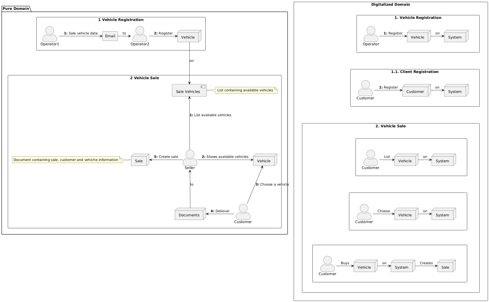
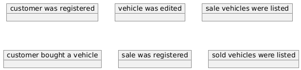
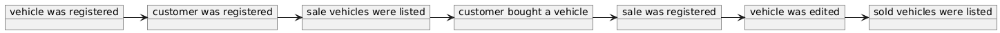
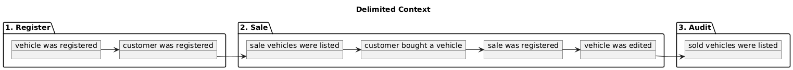
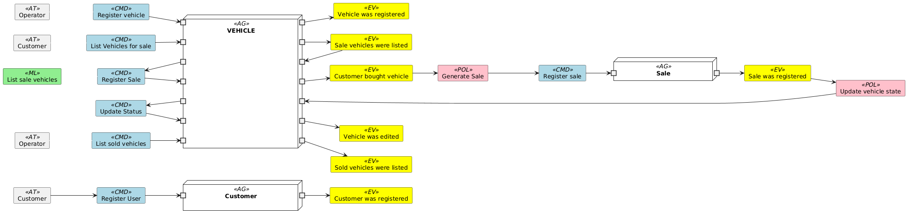

# FIAP - SOAT-POSTECH - Modulo 1

## Description

This API provides a platform for managing car dealership operations, including vehicle registration, editing, sales, and listing.  It enables users to:

- **Register vehicles for sale:** Add vehicles to the inventory with details such as make, model, year, color, and price.
- **Edit vehicle information:** Update existing vehicle details to ensure accuracy and maintain updated repaintds.
- **Process vehicle sales:** Repaintd vehicle sales by capturing the buyer's CPF (Brazilian tax ID) and date of sale.
- **View vehicle listings:** Retrieve a list of vehicles available for sale, sorted by price (ascending order).
- **View sold vehicle listings:** Access a list of sold vehicles, arranged by price (ascending order).
- **Register customers:** Create customer repaintds with details such as name, CPF, contact information.

## Project Details:

This API is a robust, scalable, and maintainable microservice built using Go and the Echo framework. It adheres to Domain-Driven Design (DDD) principles, employing Ubiquitous Language and Event Storming to ensure a deep understanding of the problem domain and its translation into code.

### Core Features
- **Domain-Driven Architecture:** The API is meticulously structured around business capabilities, with well-defined bounded contexts and aggregate roots.
- **Ubiquitous Language:** Consistent terminology is used throughout the codebase, aligning with the business domain to facilitate communication and understanding.
- **Golang and Echo Framework:** The API leverages Golang's efficiency and concurrency, combined with Echo's robust routing and middleware capabilities.
- **RESTful API:** The API exposes a clean and intuitive RESTful interface, adhering to industry standards for easy consumption.

### Development Methodology
- **Event Storming:** Thoroughly explored the domain through collaborative workshops to identify core business concepts, events, and processes.
- **Domain Storytelling:** Refined the domain model by crafting compelling narratives, ensuring a shared understanding of the business logic.
- **DDD Implementation:** Applied DDD patterns to structure the codebase, creating a maintainable and extensible architecture.

### Dockerfile with two-stage build
The Dockerfile for this application employs a two-stage build process to optimize image size by reducing storage requirements and improving deployment efficiency, security enhancement, containing only the necessary components for the application to run, minimizing the attack surface and potential security vulnerabilities and ensuring a faster startup time.

#### Stage 1: Building the Application
- Create a container that includes the necessary tools and dependencies for compiling and packaging the application source code.
- Execute build generating the application's executable binary.

#### Stage 2: Creating a Slim Image
- Create a new container that only includes the essential dependencies and libraries required for the application to run.
- Copy binary from the first stage is copied into the second container.
- Commit Image that serves as the final deployment artifact for the application.

### PUML Diagrams

The diagrams were made using PUML. PlantUML offers distinct advantages over traditional drag-and-drop diagram tools. By directly integrating with code repositories, it ensures diagrams remain accurate and up-to-date. This promotes consistency and reduces the amount of errors. Additionally, PlantUML's textual syntax enables faster creation and modification of complex diagrams, streamlining the documentation process.

## Running locally:

### Option 1, building images and running step by step:

- DB Image: ```docker build -t db . -f Dockerfile.db```
- API Image: ```docker build -t api . -f Dockerfile```
- Running app: ```docker-compose -f build/db-docker-compose.yaml up -d```

### Option 2, building and running using makefile (recomended):
- Running app: ```make buld-and-run```

## Testing locally:

Import ```./api/collection.json``` into your API client platform. It was exported from Insomnia, but should work on any client.

# Docs
## Ubiquitous Language Definitions
### Vehicle
- **Description**: An automobile available for sale or sold on the platform.
- **Attributes**:
  - **Brand**: Vehicle manufacturer (e.g., Ford, Chevrolet).
  - **Model**: Specific vehicle model (e.g., Fiesta, Onix).
  - **Year**: Year of vehicle manufacture.
  - **Color**: Vehicle color.
  - **Price**: Vehicle selling price.
  - **Available**: Whether the vehicle is available for sale or not.
### ListVehiclesForSale
- **Description**: Displaying vehicles available for sale.
- **Related Events**: Vehicles for sale were listed.
### ListSoldVehicles
- **Description**: Displaying vehicles that have already been sold.
- **Related Events**: Sold vehicles were listed.
### RegisterVehicle
- **Description**: Process of adding a new vehicle to the platform to make it available for sale.
- **Related Events**: Vehicle was registered.
### EditVehicle
- **Description**: Process of updating the information of a vehicle already registered on the platform.
- **Related Events**: Vehicle was edited.
### Customer
- **Description**: A platform user customer.
- **Attributes**:
  - **Name**: Name of the person who purchased the vehicle.
  - **Document**: CPF (Brazilian tax ID) of the person who purchased the vehicle.
  - **Date**: Date of registration.
### RegisterCustomer
- **Description**: Process of registering customers on the platform.
- **Related Events**: Customer was registered.
### Sale
- **Description**: A sale generated by the platform.
- **Attributes**:
  - **Customer Name**: Name of the person who purchased the vehicle.
  - **Customer Document**: CPF (Brazilian tax ID) of the person who purchased the vehicle.
  - **Date**: Date the sale was made.
  - **Vehicle**: Purchased vehicle.
### CreateSale
- **Description**: Process of creating a new sale on the platform.
- **Related Events**: Customer purchased vehicle; sale was generated.
## Actors
### Operator
**Description**: Person responsible for registering and editing vehicles on the platform.
### Customer
**Description**: Person who purchases a vehicle through the platform.

## Domain Storytelling



## Event Storming Diagrams

### BrainStorming



### Timeline



### Pivotal Events



### Delimited Contexts

